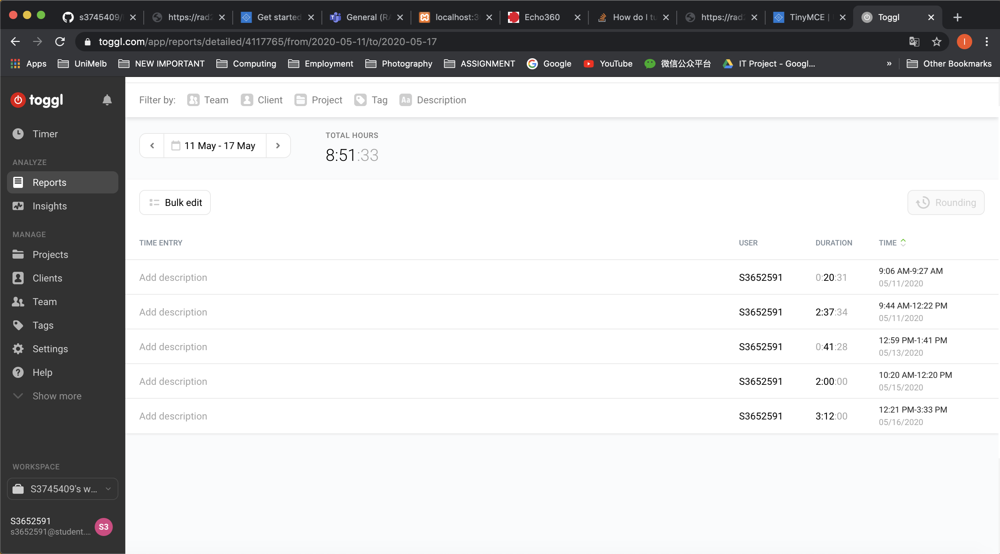

# Installation guide

git clone the project
-git clone https://github.com/s3745409/RAD2020_S3652591_S3745409.git

## Building the rails App

1. Run `docker-compose build` after every Gemfile change or to build the containers

## Running the rails App
1. Run `docker-compose up` to run the rails app
2. hit `http://0.0.0.0:3000`

# Development Team
Daniel Dominique - s3745409
Tu Lan - s3652591

# The highest level we reached 
We reached 90+ level at the end

# Time sheet
#### Tu Lan:
May4-May10

May11-May17

May18-May24

May25-May31

#### Daniel Dominique:

User|Project|Description|Start date|Start time|End date|End time|Duration|
|-------|:-:|:------:|:-----:|:-----:|:-----:|:------:|-----------------:|
s3745409|RAD|Init project files|3/5/20|8:17:22|3/5/20|9:12:34|0:55:12|
s3745409|RAD|Added static page controllers|3/5/20|9:12:47|3/5/20|9:58:12|0:30:29|
s3745409|RAD|Updated routes|3/5/20|9:59:33|3/5/20|10:11:43|0:12:10|
s3745409|RAD|Added app html partials|3/5/20|10:20:34|3/5/20|11:04:45|0:44:11|
s3745409|RAD|Updated content|3/5/20|11:06:12|3/5/20|13:51:33|2:45:21|
s3745409|RAD|Added app styling|3/5/20|14:22:13|3/5/20|15:12:42|0:50:29|
s3745409|RAD|Added unit and integration tests|3/5/20|15:13:11|3/5/20|15:45:13|0:32:02|
s3745409|RAD|Added gem for integration testing|3/5/20|15:47:22|3/5/20|15:48:43|0:01:21|
s3745409|RAD|Updated test cases|3/5/20|15:51:44|3/5/20|16:24:54|0:33:10|
s3745409|RAD|Added user controller|3/5/20|16:27:11|3/5/20|16:56:34|0:29:23|
s3745409|RAD|Updated page content|3/5/20|17:22:41|3/5/20|17:58:03|0:35:22|
s3745409|RAD|Added signup path|3/5/20|17:59:54|3/5/20|18:04:23|0:04:29|
s3745409|RAD|Changed signup test case|3/5/20|18:05:22|3/5/20|18:24:51|0:19:29|
s3745409|RAD|Added user model|3/5/20|18:27:36|3/5/20|18:44:36|0:17:00|
s3745409|RAD|Added name and email validation|3/5/20|18:48:44|3/5/20|18:54:27|0:05:43|
s3745409|RAD|Hide fixture to make tests pass|3/5/20|19:11:38|3/5/20|19:14:56|0:03:18|
s3745409|RAD|Updated user tests|3/5/20|19:18:47|3/5/20|19:42:54|0:24:07|
s3745409|RAD|Added debugger|3/5/20|19:44:51|3/5/20|19:47:51|0:03:00|
s3745409|RAD|Updated user schema|3/5/20|19:48:44|3/5/20|20:11:06|0:22:22|
s3745409|RAD|Ignore files in db folder|3/5/20|20:11:56|3/5/20|20:12:32|0:00:36|
s3745409|RAD|Updated css for user show action|3/5/20|20:14:21|3/5/20|20:45:07|0:30:46|
s3745409|RAD|Added show action|3/5/20|20:46:32|3/5/20|20:51:14|0:04:42|
s3745409|RAD|Added user show page|4/5/20|10:41:12|4/5/20|11:01:56|0:20:44|
s3745409|RAD|Added user resource|4/5/20|11:03:00|4/5/20|11:13:54|0:10:54|
s3745409|RAD|Added gravatar helper|4/5/20|11:16:56|4/5/20|11:24:52|0:07:56|
s3745409|RAD|Added form for sign up|4/5/20|11:35:12|4/5/20|12:03:16|0:28:04|
s3745409|RAD|Updated user actions|4/5/20|12:56:45|4/5/20|13:17:31|0:20:46|
s3745409|RAD|Added error  messages for sign up|4/5/20|13:22:51|4/5/20|13:47:04|0:24:13|
s3745409|RAD|Added styling for errors in flash|4/5/20|13:54:34|4/5/20|14:05:12|0:10:38|
s3745409|RAD|Updated sign up test case|4/5/20|14:07:43|4/5/20|14:18:32|0:10:49|
s3745409|RAD|Updated signup test cases|4/5/20|14:21:12|4/5/20|15:02:45|0:41:33|
s3745409|RAD|Added flash to app partial|4/5/20|16:43:12|4/5/20|17:21:41|0:38:29|
s3745409|RAD|Merge pull request #1 from s3745409/session|9/5/20|12:45:21|9/5/20|13:34:01|0:48:40|
s3745409|RAD|Merge branch 'session' into session-check|9/5/20|13:40:50|9/5/20|14:03:43|0:22:53|
s3745409|RAD|Updated js app file for bootstrap dropdown|9/5/20|14:06:04|9/5/20|14:10:01|0:03:57|
s3745409|RAD|CSS refactoring and added remember me|9/5/20|14:15:31|9/5/20|14:53:04|0:37:33|
s3745409|RAD|Added security check|9/5/20|14:56:39|9/5/20|15:26:12|0:29:33|
s3745409|RAD|Added log out and remember function|9/5/20|15:26:42|9/5/20|16:32:24|1:05:42|
s3745409|RAD|Cleaned up head partial|9/5/20|16:36:32|9/5/20|16:45:00|0:08:28|
s3745409|RAD|Added remembe me checkbox|9/5/20|16:46:49|9/5/20|17:53:02|1:06:13|
s3745409|RAD|Fixed spacing issues in files|9/5/20|17:53:15|9/5/20|18:06:41|0:13:26|
s3745409|RAD|Added n+1 testing for logout and remember function|9/5/20|18:11:51|9/5/20|18:31:27|0:19:36|
s3745409|RAD|Added user profile image and name to header|9/5/20|18:35:42|9/5/20|19:41:25|1:05:43|
s3745409|RAD|Added blog summary partial|10/5/20|9:36:22|10/5/20|10:03:38|0:27:16|
s3745409|RAD|Cleaned up gem file|21/5/20|10:05:45|21/5/20|10:32:05|0:26:20|
s3745409|RAD|removed db folder ignore|21/5/20|10:34:44|21/5/20|10:36:45|0:02:01|
s3745409|RAD|Added makefile|21/5/20|10:38:34|21/5/20|10:53:58|0:15:24|
s3745409|RAD|db migrations|21/5/20|10:54:19|21/5/20|11:02:47|0:08:28|
s3745409|RAD|Updated model and controller for phone|21/5/20|11:05:36|21/5/20|11:32:56|0:27:20|
s3745409|RAD|Updated button text|21/5/20|11:34:51|21/5/20|11:45:27|0:10:36|
s3745409|RAD|Updated tests for login and signup|21/5/20|11:51:58|21/5/20|12:01:49|0:09:51|
s3745409|RAD|Additional testing|22/5/20|12:03:16|22/5/20|12:41:35|0:38:19|
s3745409|RAD|Updated tests|22/5/20|13:17:31|22/5/20|13:44:16|0:26:45|
s3745409|RAD|Updated footer with student info|23/5/20|13:47:04|23/5/20|14:01:37|0:14:33|
s3745409|RAD|Added link and post summary templates|23/5/20|14:05:12|23/5/20|14:16:29|0:11:17|
s3745409|RAD|Added structure and styling to home page.|23/5/20|14:18:32|23/5/20|14:57:36|0:39:04|
s3745409|RAD|CSS tweaking homepage|23/5/20|15:02:45|23/5/20|16:36:31|1:33:46|
s3745409|RAD|Merge pull request #2 from s3745409/f/testing|23/5/20|16:45:00|23/5/20|17:22:47|0:37:47|
s3745409|RAD|Merge pull request #3 from s3745409/f/homepage|23/5/20|17:53:02|23/5/20|18:03:56|0:10:54|
s3745409|RAD|Troubleshoot db schema|24/5/20|18:06:41|24/5/20|18:09:55|0:03:14|
s3745409|RAD|Added new post form and action|24/5/20|18:31:27|24/5/20|18:48:04|0:16:37|
s3745409|RAD|Merge pull request #5 from s3745409/f/newpost|24/5/20|18:49:33|24/5/20|19:03:44|0:14:11|
s3745409|RAD|Added structure and styling to profile page|24/5/20|19:05:51|24/5/20|19:51:23|0:45:32|
s3745409|RAD|Added upload feature|24/5/20|19:55:41|24/5/20|20:05:21|0:09:40|
s3745409|RAD|Merge pull request #6 from s3745409/f/profile|24/5/20|20:12:46|24/5/20|20:49:03|0:36:17|
s3745409|RAD|Updated post form css|24/5/20|20:52:44|24/5/20|21:03:11|0:10:27|
s3745409|RAD|Updated styling on signup and login pages|24/5/20|21:09:50|24/5/20|21:41:09|0:31:19|
s3745409|RAD|Updated profie edit page|24/5/20|21:42:21|24/5/20|21:59:47|0:17:26|
s3745409|RAD|Fixed image upload error|25/5/20|14:02:51|25/5/20|14:48:11|0:45:20|
s3745409|RAD|Merge branch 'f/layout' into development|25/5/20|15:23:47|25/5/20|15:57:36|0:33:49|
s3745409|RAD|Updated profile main page|26/5/20|7:46:35|26/5/20|8:12:17|0:25:42|
s3745409|RAD|merge dev into profile|26/5/20|8:15:27|26/5/20|8:18:56|0:03:29|
s3745409|RAD|Merge branch 'development' into f/profile|26/5/20|8:21:04|26/5/20|8:36:39|0:15:35|
s3745409|RAD|Added AJAX to profiles page|27/5/20|8:41:53|27/5/20|8:50:28|0:08:35|
s3745409|RAD|Update Gemfile|27/5/20|8:53:26|27/5/20|8:59:24|0:05:58|
s3745409|RAD|Merge branch 'f/layout' into development|28/5/20|9:02|28/5/20|9:27:36|0:25:36|
s3745409|RAD|Updated post show page|28/5/20|9:12:34|28/5/20|9:33:46|0:21:12|
s3745409|RAD|Updated gemfile|28/5/20|9:58:12|28/5/20|9:59:49|0:01:37|
s3745409|RAD|Updated gemfile|28/5/20|10:11:43|28/5/20|10:51:26|0:39:43|
s3745409|RAD|Fiex styling on selected post page|28/5/20|11:04:45|28/5/20|12:45:04|1:40:19|
s3745409|RAD|Merge pull request #8 from s3745409/f/selectedposts|28/5/20|13:51:33|28/5/20|14:34:47|0:43:14|
s3745409|RAD|Updated navigation|28/5/20|15:12:42|28/5/20|15:44:04|0:31:22|
s3745409|RAD|Merge pull request #9 from s3745409/f/selectedposts|28/5/20|15:45:13|28/5/20|15:47:00|0:01:47|
s3745409|RAD|Added error message to new post page|28/5/20|15:48:43|28/5/20|16:21:45|0:33:02|
s3745409|RAD|Merge branch 'f/profile' into development|28/5/20|16:24:54|28/5/20|16:42:57|0:18:03|
s3745409|RAD|Update Gemfile.lock|28/5/20|16:56:34|28/5/20|16:58:52|0:02:18|
s3745409|RAD|Updated ruby version|29/5/20|17:58:03|29/5/20|17:59:58|0:01:55|
s3745409|RAD|Fixed styling on comments page|30/5/20|18:04:23|30/5/20|18:23:11|0:18:48|
s3745409|RAD|Merge pull request #12 from s3745409/f/reset|30/5/20|18:24:51|30/5/20|18:40:37|0:15:46|
s3745409|RAD|Merge branch 'reset'into development|30/5/20|18:44:36|30/5/20|18:50:07|0:05:31|
s3745409|RAD|Fixed avatar image display|30/5/20|18:54:27|30/5/20|19:01:58|0:07:31|
s3745409|RAD|Fixed post item comment live count|30/5/20|19:14:56|30/5/20|19:38:41|0:23:45|
s3745409|RAD|merge 'f/mailer' into 'development'|30/5/20|19:42:54|30/5/20|19:45:32|0:02:38|
s3745409|RAD|Merge branch 'development' into f/post|30/5/20|19:47:51|30/5/20|20:08:29|0:20:38|
s3745409|RAD|Updated post item title highlighting|30/5/20|20:11:06|30/5/20|21:36:06|1:25:00|
s3745409|RAD|Added rich text editor|30/5/20|21:41:09|30/5/20|21:57:53|0:16:44|
s3745409|RAD|Added phone to signup form|30/5/20|21:59:47|30/5/20|22:01:31|0:01:44|
s3745409|RAD|Updated ruby version|30/5/20|22:09:21|30/5/20|22:27:00|0:17:39|
s3745409|RAD|updating rich text editor|30/5/20|22:33:56|30/5/20|22:57:35|0:23:39|
s3745409|RAD|Fixed editor locations|30/5/20|22:59:20|30/5/20|23:05:44|0:06:24|
s3745409|RAD|Merge branch 'development' of github.com:s3745409/RAD2020_S3652591_S3745409 into development|30/5/20|23:08:42|30/5/20|23:24:50|0:16:08|
s3745409|RAD|Updted ruby version|30/5/20|23:27:21|30/5/20|23:29:11|0:01:50|
TOTAL|||||||42:07:17|
# Heroku URL and last deployment log

## Application URL

https://rad2020-assignment-two-v1.herokuapp.com/

## Last Deployment Log

-   -----> Ruby app detected
-   -----> Installing bundler 1.17.3
-   -----> Removing BUNDLED WITH version in the Gemfile.lock
-   -----> Compiling Ruby/Rails
-   -----> Using Ruby version: ruby-2.5.8
-   -----> Installing dependencies using bundler 1.17.3
-        Running: bundle install --without development:test --path vendor/bundle --binstubs vendor/bundle/bin -j4 --deployment
-        The dependency tzinfo-data (>= 0) will be unused by any of the platforms Bundler is installing for. Bundler is installing for ruby but the dependency is only for x86-mingw32, x86-mswin32, x64-mingw32, java. To add those platforms to the bundle, run `bundle lock --add-platform x86-mingw32 x86-mswin32 x64-mingw32 java`.
-        Using rake 13.0.1
-        Using concurrent-ruby 1.1.6
-        Using i18n 1.8.2
-        Using minitest 5.14.0
-        Using thread_safe 0.3.6
-        Using tzinfo 1.2.7
-        Using activesupport 5.2.4.2
-        Using builder 3.2.4
-        Using erubi 1.9.0
-        Using mini_portile2 2.4.0
-        Using nokogiri 1.10.9
-        Using rails-dom-testing 2.0.3
-        Using crass 1.0.6
-        Using loofah 2.5.0
-        Using rails-html-sanitizer 1.3.0
-        Using actionview 5.2.4.2
-        Using rack 2.2.2
-        Using rack-test 1.1.0
-        Using actionpack 5.2.4.2
-        Using nio4r 2.5.2
-        Using websocket-extensions 0.1.4
-        Using websocket-driver 0.7.1
-        Using actioncable 5.2.4.2
-        Using globalid 0.4.2
-        Using activejob 5.2.4.2
-        Using mini_mime 1.0.2
-        Using mail 2.7.1
-        Using actionmailer 5.2.4.2
-        Using activemodel 5.2.4.2
-        Using arel 9.0.0
-        Using activerecord 5.2.4.2
-        Using mimemagic 0.3.5
-        Using marcel 0.3.3
-        Using activestorage 5.2.4.2
-        Using public_suffix 4.0.4
-        Using addressable 2.7.0
-        Using execjs 2.7.0
-        Using autoprefixer-rails 9.7.6
-        Using bcrypt 3.1.13
-        Using msgpack 1.3.3
-        Using bootsnap 1.4.6
-        Using ffi 1.12.2
-        Using sassc 2.3.0
-        Using bootstrap-sass 3.4.1
-        Using bundler 1.17.3
-        Using mini_magick 4.10.1
-        Using ruby-vips 2.0.17
-        Using image_processing 1.10.3
-        Using carrierwave 2.1.0
-        Using coffee-script-source 1.12.2
-        Using coffee-script 2.4.1
-        Using method_source 1.0.0
-        Using thor 1.0.1
-        Using railties 5.2.4.2
-        Using coffee-rails 4.2.2
-        Using font-awesome-rails 4.7.0.5
-        Using jbuilder 2.10.0
-        Using jquery-rails 4.3.5
-        Using pg 1.2.3
-        Using puma 3.12.4
-        Using sprockets 3.7.2
-        Using sprockets-rails 3.2.1
-        Using rails 5.2.4.2
-        Using rb-fsevent 0.10.4
-        Using rb-inotify 0.10.1
-        Using sass-listen 4.0.0
-        Using sass 3.7.4
-        Using tilt 2.0.10
-        Using sass-rails 5.1.0
-        Using turbolinks-source 5.2.0
-        Using turbolinks 5.2.1
-        Using uglifier 4.2.0
-        Bundle complete! 26 Gemfile dependencies, 72 gems now installed.
-        Gems in the groups development and test were not installed.
-        Bundled gems are installed into `./vendor/bundle`
-        Bundle completed (0.46s)
-        Cleaning up the bundler cache.
-        The dependency tzinfo-data (>= 0) will be unused by any of the platforms Bundler is installing for. Bundler is installing for ruby but the dependency is only for x86-mingw32, x86-mswin32, x64-mingw32, java. To add those platforms to the bundle, run `bundle lock --add-platform x86-mingw32 x86-mswin32 x64-mingw32 java`.
-   -----> Installing node-v10.15.3-linux-x64
-   -----> Detecting rake tasks
-   -----> Preparing app for Rails asset pipeline
-        Running: rake assets:precompile
-        Yarn executable was not detected in the system.
-        Download Yarn at https://yarnpkg.com/en/docs/install
-        I, [2020-05-31T07:08:27.997662 #276]  INFO -- : Writing /tmp/build_a04200ecfc7649b06c82319773048d47/public/assets/application-e18572a664528e4b133fedab53cb1b3c9f7ee25c81a02a61923489c7f16a8938.css
-        I, [2020-05-31T07:08:27.998220 #276]  INFO -- : Writing /tmp/build_a04200ecfc7649b06c82319773048d47/public/assets/application-e18572a664528e4b133fedab53cb1b3c9f7ee25c81a02a61923489c7f16a8938.css.gz
-        Asset precompilation completed (8.38s)
-        Cleaning assets
-        Running: rake assets:clean
-        I, [2020-05-31T07:08:29.560417 #287]  INFO -- : Removed application-67be93943f615ff3ceb099e4416dd6ed2bf16e1e61cc7f7c0352e44a2bed9839.css
-   -----> Detecting rails configuration
- ###### WARNING:
-        You set your `config.active_storage.service` to :local in production.
-        If you are uploading files to this app, they will not persist after the app
-        is restarted, on one-off dynos, or if the app has multiple dynos.
-        Heroku applications have an ephemeral file system. To
-        persist uploaded files, please use a service such as S3 and update your Rails
-        configuration.
-        For more information can be found in this article:
-          https://devcenter.heroku.com/articles/active-storage-on-heroku
- ###### WARNING:
-        We detected that some binary dependencies required to
-        use all the preview features of Active Storage are not
-        present on this system.
-        For more information please see:
-          https://devcenter.heroku.com/articles/active-storage-on-heroku

- ###### WARNING:
-        No Procfile detected, using the default web server.
-        We recommend explicitly declaring how to boot your server process via a Procfile.
-        https://devcenter.heroku.com/articles/ruby-default-web-server
-   -----> Discovering process types
-        Procfile declares types     -> (none)
-        Default types for buildpack -> console, rake, web
-   -----> Compressing...
-        Done: 59.2M
-   -----> Launching...
-        Released v20
-        https://rad2020-assignment-two-v1.herokuapp.com/ deployed to Heroku